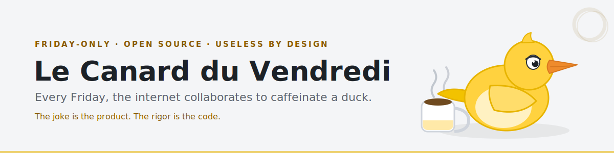
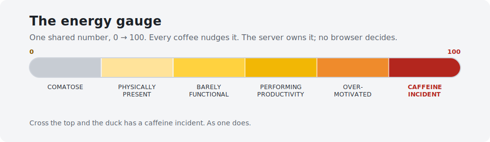
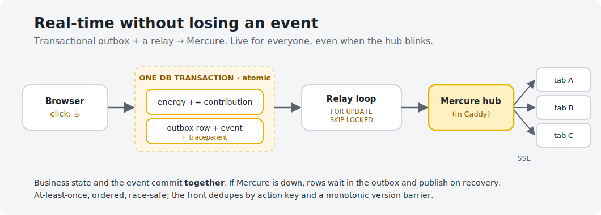
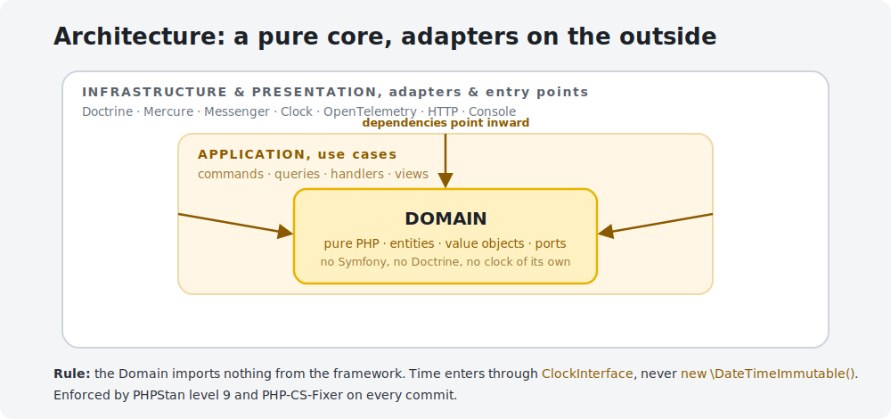

<p align="center">
  
</p>

<p align="center">
  
  
  
  
  
  
</p>

> **Principle: the joke is the product, the rigor is the code.** The app is
> deliberately useless. Its execution is not.

A duck sleeps from Saturday to Thursday. On **Friday** (Europe/Paris), visitors
show up and, together and in real time:

- **serve it coffee**, a shared `0 → 100` energy gauge;
- **vote** for the accessory it wears that day;
- **react** to one catastrophically bad piece of career advice.

Everything is synchronized live across every open tab. Serve a coffee and the
gauge climbs for *everyone*, instantly, no refresh. It is a running gag built like
it pages someone at 3am, because the point was never the duck. It was to have a
small, self-contained product where every "boring" decision (time, concurrency,
real-time delivery, observability, deployment) is made properly and can be
explained out loud.

🔴 **Live at [tibec.labault.dev](https://tibec.labault.dev)**, though the duck
only wakes up on Fridays. The rest of the week it sleeps, by design.

## What happens on a Friday

The whole product is one number that a crowd pushes around, plus two votes.

<p align="center">
  
</p>

- **Coffee** moves the energy. Three coffees max per visitor per Friday, so the
  gauge is a *collective* effort, not a one-person spam button.
- **The accessory** is a community vote between three options, closed at 14:00,
  then applied to the duck for the rest of the day.
- **The advice** is one weekly catastrophe with three reactions, one per visitor.

Push the gauge over the top and the duck has a caffeine incident. As one does.

## Why it's worth a look

A useless app is the perfect excuse to do the unglamorous parts right. The
interesting bits:

- **The server is the only source of truth**, temporal *and* business. The
  browser decides nothing: not what day it is, not the energy, not the coffee
  quota, not the vote winner. Stimulus, Theatre.js and the SVG just render what
  the server already validated.
- **Time is an injectable dependency.** Everything goes through a
  `ClockInterface` (`SystemClock` in prod, `FrozenClock` in tests,
  `ConfigurableClock` via `APP_FAKE_NOW` locally). Calling `new \DateTimeImmutable()`
  inside the domain is forbidden, and the prod binding can't read the fake clock
  even if someone tries.
- **Idempotency everywhere it counts.** Coffee, vote and reaction each carry a
  unique key, so a double-click or a network replay never counts twice.
- **A transactional outbox** makes real time reliable (see below).
- **Stateless services under the FrankenPHP worker.** The kernel boots once and
  serves thousands of requests; any visitor state leaking between two requests is
  treated as a bug, not a quirk.
- **Observability that tells the truth**, including a dead-man switch: a silent
  telemetry pipeline is itself alerted, never mistaken for "all good".
- **Production hardening:** non-root, read-only image; blocking healthcheck with
  automatic rollback; encrypted off-site PostgreSQL backups with a tested restore.

### Real-time, without losing an event

Serving a coffee writes the business change **and** the event to publish in the
*same* database transaction. A separate relay then ships it to the Mercure hub.
If the hub is down, nothing is lost: rows wait in the outbox and go out on
recovery.

<p align="center">
  
</p>

## Architecture

A modular Symfony monolith with strict layers: a pure `Domain` core, an
`Application` layer of use cases around it, and `Infrastructure` / `Presentation`
as the adapters and entry points on the outside. Dependencies only ever point
inward.

<p align="center">
  
</p>

| Layer            | Role                                                       | May depend on                   |
| ---------------- | --------------------------------------------------------- | ------------------------------- |
| `Domain`         | Core: entities, value objects, events, ports              | **Pure PHP only**               |
| `Application`    | Use cases: commands, queries, handlers, views             | `Domain`                        |
| `Infrastructure` | Adapters: Doctrine, Mercure, Messenger, clock, OTel       | `Domain`, `Application`, vendors |
| `Presentation`   | Entry points: HTTP, Console                                | `Application`, `Domain`         |

Full reasoning in [docs/architecture.md](docs/architecture.md). The SVG +
Theatre.js choice (over Rive) is its own decision record:
[ADR 0001](docs/adr/0001-svg-theatrejs-vs-rive.md).

## Tech stack

| Area              | Choice                                                    |
| ----------------- | -------------------------------------------------------- |
| Backend           | Symfony 7.4 (modular monolith), PHP 8.4+                 |
| Server            | FrankenPHP (worker mode, stateless services)           |
| Database          | PostgreSQL (via Doctrine ORM)                            |
| Rendering         | Twig (server-rendered), inline SVG                       |
| Animation         | Theatre.js (`@theatre/core` in prod), driven by Stimulus |
| Real time         | Mercure (hub co-located in Caddy) + transactional outbox |
| Async             | Symfony Messenger + Scheduler                            |
| Identity          | Anonymous cookie, no account                             |
| Observability     | OpenTelemetry → OTel Collector → Grafana stack          |
| Browser tests     | Playwright (three frozen clocks)                         |
| Quality gate      | PHPStan level 9, PHP-CS-Fixer, Rector, PHPUnit          |

## Quick start

**Prerequisites:** Docker (via OrbStack, never Docker Desktop) to run the app;
PHP 8.4+ and Composer on the host for the quality tooling.

```sh
# 1. Local config
cp .env.example .env        # adjust DATABASE_URL, MERCURE_*, APP_FAKE_NOW… if needed

# 2. Start the stack (FrankenPHP app + PostgreSQL) and apply migrations
make start                  # = up (build + blocking healthcheck) + migrate

# 3. Quality tooling (the tools come from your machine, not the repo)
composer install            # required for PHPStan / CS-Fixer / tests locally
make qa                     # lint + PHPStan (level 9) + tests
```

Once `make start` is done, the app answers on **`https://localhost`**
(self-signed cert from FrankenPHP, accept it once in the browser). To feel the
real-time loop locally, run the relay in another shell: `make relay`.

### Local URLs and the three frozen clocks

| Service                | URL / port              | What                                                           |
| ---------------------- | ----------------------- | ------------------------------------------------------------- |
| **App (dev)**          | `https://localhost`     | the app, FrankenPHP in classic mode, no worker (`80` → `443`) |
| PostgreSQL             | `localhost:5432`        | database                                                      |
| E2E, `app-friday`     | `http://localhost:8081` | test fixture, clock **frozen on a Friday morning**            |
| E2E, `app-afternoon`  | `http://localhost:8082` | test fixture, Friday afternoon                                |
| E2E, `app-dormant`    | `http://localhost:8083` | test fixture, a dormant day (the duck sleeps)                 |

> ⚠️ **Gotcha:** `localhost:8081`–`8083` are the **E2E stack** (`compose.e2e.yaml`),
> frozen clocks for deterministic tests, **not** your dev stack. They are built
> when the E2E suite starts and may serve older code. To see *your* changes, use
> **`https://localhost`**.

**Why three instances?** Everything the duck does depends on what time it is
(Friday morning, Friday afternoon, or a dormant day). Rather than wait for a real
Friday, the E2E suite runs three copies of the app, each with its clock **frozen**
on a precise instant (`APP_FAKE_NOW`), covering the three states reproducibly.
That is the whole point of the injectable clock. Ports are overridable via
`HTTP_PORT` / `HTTPS_PORT` / `POSTGRES_PORT` (see `.env.example`).

### HTTP surface

| Method | Route                                      | Purpose                          |
| ------ | ------------------------------------------ | -------------------------------- |
| `GET`  | `/api/friday/current`                      | current friday state (computed)  |
| `POST` | `/api/friday/current/coffees`              | serve a coffee                   |
| `POST` | `/api/friday/current/accessory-votes`      | cast an accessory vote           |
| `PUT`  | `/api/friday/current/advice-reaction`      | react to the weekly advice       |
| `GET`  | `/health`                                  | liveness                         |
| `GET`  | `/health/ready`                            | readiness (database included)    |

## `make` commands

Everything goes through `make` (tools come from the machine, not the repo). Run
`make help` for the full list with descriptions.

### Daily dev

| Command                  | Effect                                                       |
| ------------------------ | ----------------------------------------------------------- |
| `make start` / `make up` | start the stack (`start` also runs migrations)              |
| `make down`              | stop the stack and remove containers                        |
| `make restart`          | recycle the stack (re-reads env at boot)                     |
| `make logs` / `make ps`  | follow app logs / list container status                     |
| `make sh` / `make db`    | shell in the app container / `psql` on the dev database     |
| `make migrate` / `make migration` | apply migrations / generate one from the entity diff |
| `make worker` / `make relay` | run the Messenger worker / the outbox→Mercure relay     |

### Quality (before committing)

| Command                           | Effect                                |
| --------------------------------- | ------------------------------------- |
| `make qa`                         | everything: `lint` + `stan` + `test`  |
| `make stan`                       | PHPStan level 9                       |
| `make cs` / `make cs-fix`         | PHP-CS-Fixer (check / fix)            |
| `make rector` / `make rector-fix` | Rector (preview / apply)              |
| `make fix`                        | full auto-fix (CS-Fixer + Rector)     |
| `make hooks`                      | install git hooks (pre-commit + commit-msg) |

### End-to-end and observability

| Command                        | Effect                                                  |
| ------------------------------ | ------------------------------------------------------ |
| `make e2e-all`                 | build front, run Playwright against the E2E stack, tear down |
| `make e2e-up` / `make e2e-down`| bring the E2E stack up / down                           |
| `make obs-up` / `make obs-down`| local observability stack (Collector + Grafana + Prometheus…) |

### Production (used on the VPS / by `deploy.sh`)

| Command                         | Effect                                              |
| ------------------------------- | -------------------------------------------------- |
| `make deploy`                   | orchestrated deploy (build → migrations → up → blocking healthcheck) |
| `make smoke`                    | smoke-test the real behavior on the public domain  |
| `make prod-up` / `make prod-down` / `make prod-logs` | manage the prod stack             |
| `make obs-prod-up`              | production observability stack (separate, on the VPS) |
| `make backup-now` / `make backup-restore-test` | run a backup / test a restore to a throwaway target |

> The server is the **only source of truth**, temporal and business. In
> development a Friday can be simulated via `APP_FAKE_NOW` (see `.env.example`).
> This variable is **neutralized in production** by construction.
>
> **Dev vs E2E/prod, where the code lives:** in dev the code is **bind-mounted**
> (`./:/app`) and FrankenPHP runs **without the worker** (classic mode), so the
> kernel (router included) is rebuilt per request and your edits (routes too) are
> picked up **with nothing to restart**. In E2E and prod the FrankenPHP worker is
> **on** (kernel in RAM, for speed) and the code is **baked into the image** at
> build time: editing a source file changes nothing until the image is rebuilt
> (E2E: `make e2e-up`; prod: a redeploy). Details in the
> [technical guide](docs/guide-technique.md).

## Project layout

```text
src/
├─ Domain/          pure PHP: Friday, Coffee, Accessory, Advice, Cycle, Outbox, Duck…
├─ Application/     use cases: commands, queries, handlers, views
├─ Infrastructure/ adapters: Persistence (Doctrine), Mercure, Messaging, Clock, Observability
└─ Presentation/   entry points: Http controllers, Console commands
assets/duck/       front: Theatre.js rig, real-time client, telemetry
docs/              the references below
```

## Status

Built end-to-end. The three mechanics, real-time delivery, the async weekly
cycle, full observability, the Playwright suite and the production deployment
(push-to-deploy, hardened image, automated backups) are all implemented, the
nine phases of the [roadmap](docs/cdc_friday_duck.md) (§32). It is a personal lab
project: a small, finished, deliberately silly product used to practice the
serious parts.

## Documentation

| Document                                                       | Contents                                            |
| -------------------------------------------------------------- | --------------------------------------------------- |
| [Specification](docs/cdc_friday_duck.md)                       | Full functional and technical reference (the bible) |
| [Technical guide](docs/guide-technique.md)                     | Environments (dev/E2E/prod), real time, the clock   |
| [Architecture](docs/architecture.md)                           | Layers, boundaries, backend pipeline                |
| [Observability](docs/observability.md)                         | Traces, metrics, dashboards, alerts                 |
| [Deployment](docs/deployment.md)                               | FrankenPHP image, CI/CD, rollback                   |
| [Runbook](docs/runbook.md)                                     | Operations, incidents, Messenger replay             |
| [Runbook: prod observability](docs/runbook-observability.md)  | The long-lived obs stack on the VPS                 |
| [Runbook: backups](docs/runbook-backup.md)                    | PostgreSQL backup and restore                       |
| [ADR](docs/adr/)                                               | Architecture decision records                       |
| [Contributing](CONTRIBUTING.md)                                | Workflow, commits, hooks                            |

## License

See [LICENSE](LICENSE).
