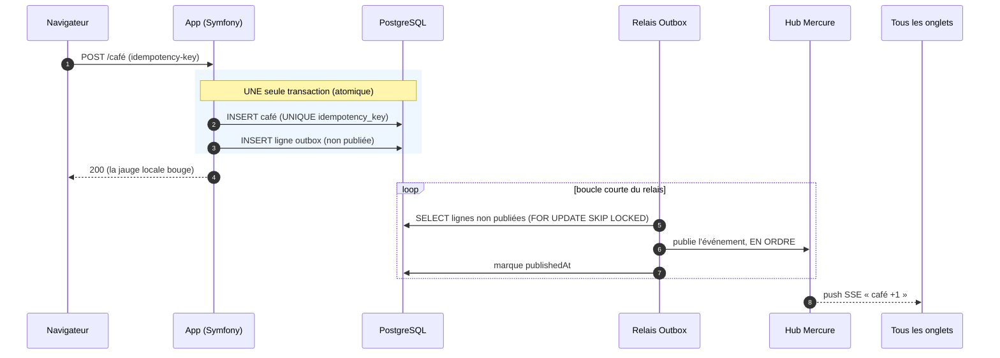
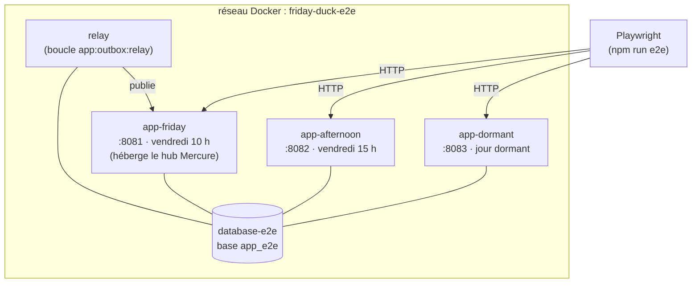

# Guide technique — Le Canard du Vendredi

> Comment ce projet est câblé, et **pourquoi**. Ce document couvre le temps réel
> (Mercure + Outbox), l'horloge injectable, et surtout les **trois environnements**
> (dev, E2E, prod) : ce qui les distingue, comment on les lance, comment on les
> arrête, et où vit le code dans chacun.
>
> Références faisant foi : le [cahier des charges](cdc_friday_duck.md) (les §N
> ci-dessous y renvoient) et l'[architecture](architecture.md).

## Table des matières

1. [Le produit en une page](#1-le-produit-en-une-page)
2. [La stack en couches](#2-la-stack-en-couches)
3. [L'horloge injectable : le temps comme dépendance](#3-lhorloge-injectable--le-temps-comme-dépendance)
4. [Le temps réel : pourquoi Mercure (et pourquoi un Outbox)](#4-le-temps-réel--pourquoi-mercure-et-pourquoi-un-outbox)
5. [Les trois environnements : dev, E2E, prod](#5-les-trois-environnements--dev-e2e-prod)
6. [La stack de test E2E en détail](#6-la-stack-de-test-e2e-en-détail)
7. [Le déploiement en production](#7-le-déploiement-en-production)
8. [Antisèche commandes](#8-antisèche-commandes)

---

## 1. Le produit en une page

Le Canard du Vendredi est une appli web volontairement inutile. Du **samedi au
jeudi**, le canard dort. **Le vendredi**, les visiteurs, collectivement et en
temps réel :

- lui servent du **café** (une jauge `0 → 100`) ;
- **votent** pour son accessoire ;
- **réagissent** à un conseil professionnel catastrophique.

Tout est synchronisé live entre tous les onglets ouverts. Un visiteur qui sert un
café doit voir la jauge monter chez **tout le monde**, immédiatement, sans
recharger la page.

> **Principe directeur : l'humour est dans le produit, la rigueur est dans le
> code.** L'appli est une blague ; son exécution ne l'est pas.

Deux conséquences techniques structurantes en découlent, et expliquent la moitié
de ce document :

1. **Le comportement dépend entièrement de l'heure** (vendredi ? matin ?
   après-midi ? jour dormant ?). → d'où l'**horloge injectable** (§3) et les
   **trois instances de test** (§6).
2. **L'état est partagé et synchronisé en direct** entre visiteurs. → d'où
   **Mercure** et le **pattern Outbox** (§4).

---

## 2. La stack en couches

| Domaine          | Choix                                                    |
| ---------------- | -------------------------------------------------------- |
| Backend          | Symfony 7.4 (monolithe modulaire), PHP 8.4+              |
| Serveur          | FrankenPHP (Caddy + PHP embarqué) en **mode worker**     |
| Base de données  | PostgreSQL (Doctrine ORM)                                |
| Rendu            | Twig (rendu serveur) + SVG inline, animé par Theatre.js  |
| Temps réel       | **Mercure** (hub co-localisé dans Caddy)                 |
| Asynchrone       | Symfony Messenger + Scheduler (relais Outbox)            |
| Observabilité    | OpenTelemetry → pile Grafana                             |

Le code respecte des **frontières de couches strictes** (§30) :

```text
Presentation  (HTTP/Console)   ← points d'entrée fins
     │
Application   (cas d'usage)    ← orchestre le Domaine
     │
Domain        (PHP pur)        ← métier, AUCUN use Symfony/Doctrine ; définit des PORTS (interfaces)
     │
Infrastructure (adapters)      ← implémente les ports : Doctrine, Mercure, horloge, OTel
```

La règle d'or : le **Domaine** ne connaît ni Symfony ni Doctrine. Il déclare des
interfaces (`ClockInterface`, `RealTimeTransport`, `OutboxEntryRepository`…) que
l'**Infrastructure** branche sur le monde réel. C'est ce découplage qui rend le
temps et le transport temps réel **remplaçables** — exactement ce qu'exploitent
les tests.

### Le mode worker, en un mot

FrankenPHP sert l'appli en **mode worker** : le kernel Symfony est amorcé **une
fois** au démarrage du process, puis réutilisé entre les requêtes (§22.2). C'est
rapide, mais ça impose une règle : **les services doivent être *stateless*** —
aucun état visiteur ne doit survivre d'une requête à l'autre.

> ⚠️ **Conséquence pratique sur le code « en mémoire ».** Comme le kernel persiste,
> du code compilé (routes, conteneur DI) est chargé au boot du worker. En **dev**,
> ce n'est pas un souci : le worker tourne en mode *watch* et **redémarre à chaud
> dès qu'un fichier change** (voir §5). En **E2E/prod**, le code est figé dans
> l'image — il faut reconstruire (voir §5–§6).

---

## 3. L'horloge injectable : le temps comme dépendance

**Le serveur est l'unique source de vérité temporelle** (§7.1). Le navigateur ne
décide jamais s'il est vendredi : il demande au serveur. Et le serveur ne lit
jamais l'heure « en dur ».

> **Interdiction absolue** d'appeler `new \DateTimeImmutable()` ou `new \DateTime()`
> dans un service de Domaine (§7.3). Le temps passe **exclusivement** par
> `App\Domain\Shared\Clock\ClockInterface`.

Pourquoi se donner ce mal ? Parce qu'une appli dont **tout** le comportement
dépend de la date est un cauchemar à tester si on ne peut pas **figer le temps**.
En faisant du temps une dépendance injectable, on peut dire « on est vendredi
10 h » sans attendre vendredi 10 h.

Trois implémentations de l'interface, une par contexte :

| Implémentation       | Contexte         | Comportement                                            |
| -------------------- | ---------------- | ------------------------------------------------------- |
| `SystemClock`        | **production**   | l'heure réelle (`Europe/Paris`)                         |
| `FrozenClock`        | **tests** (unité)| un instant figé, fixé par le test                       |
| `ConfigurableClock`  | **dev / préprod**| honore `APP_FAKE_NOW` si présent, sinon l'heure réelle  |

`APP_FAKE_NOW` est la clé de voûte du dev et des tests E2E : une variable
d'environnement qui **gèle l'horloge métier** sur un instant choisi.

```sh
# Simuler un vendredi matin en local, sans attendre vendredi :
APP_FAKE_NOW=2026-07-03T10:30:00+02:00 make up
```

> 🔒 **Garde-fou prod.** `FakeClockProductionGuard` garantit que `APP_FAKE_NOW`
> est **neutralisée en production** (§7.4) : impossible de figer le temps sur le
> site live, même par erreur de config. En `prod`, c'est `SystemClock`, point.

Retenir cette section : **« on est vendredi » est une donnée injectée, pas une
lecture de `date()`.** C'est ce qui permet, au §6, de faire tourner trois copies
de l'appli bloquées à trois moments différents.

---

## 4. Le temps réel : pourquoi Mercure (et pourquoi un Outbox)

### Le besoin

Quand un visiteur sert un café, la jauge doit monter **chez tous les autres
visiteurs**, instantanément. C'est du **push serveur → navigateurs** : le serveur
doit pouvoir prévenir des clients déjà connectés, sans qu'ils aient à demander.

Le polling (le navigateur qui redemande « alors, ça a changé ? » toutes les 2 s)
serait laid, lent et coûteux. Il faut un canal serveur → client.

### Pourquoi Mercure

[Mercure](https://mercure.rocks) est un protocole de push bâti sur les
**Server-Sent Events** (SSE) : une connexion HTTP longue durée sur laquelle le
serveur **pousse** des messages. C'est le bon outil ici :

- **Natif navigateur** (`EventSource`), zéro lib lourde côté front ;
- **Modèle pub/sub par *topics*** : chaque édition du vendredi est un topic ; un
  onglet s'abonne, le serveur publie ;
- **Intégré à l'écosystème Symfony** et, surtout, **co-localisé dans FrankenPHP**.

> 🧩 **Pas de conteneur Mercure séparé.** Le hub Mercure tourne **dans le même
> process Caddy/FrankenPHP** que l'appli (§21, voir `frankenphp/Caddyfile`). Un
> binaire, un port. Symfony **signe** un JWT (`MERCURE_JWT_SECRET`) pour publier ;
> le hub vérifie cette signature. Les abonnés, eux, sont **anonymes** (cohérent
> avec le visiteur sans compte, §5).

Trois URL à ne pas confondre dans la config (`compose.yaml`) :

| Variable             | Rôle                                                                 |
| -------------------- | -------------------------------------------------------------------- |
| `MERCURE_URL`        | URL **interne** où l'app **publie** (`http://app/...`, HTTP, sans TLS)|
| `MERCURE_PUBLIC_URL` | URL **publique** où le **navigateur s'abonne** (`https://localhost/...`)|
| `MERCURE_JWT_SECRET` | secret partagé : l'app signe, le hub vérifie                          |

### Le problème de fiabilité → le pattern Outbox

Naïvement, on ferait : « j'enregistre le café en base, **puis** je publie sur
Mercure ». Mais que se passe-t-il si le process meurt **entre les deux** ? Le café
est compté en base, mais **jamais diffusé**. La jauge des autres visiteurs ment.
À l'inverse, publier avant de committer risque de diffuser un café qui sera ensuite
annulé. Ces deux écritures (base + diffusion) ne sont pas dans la même transaction —
on ne peut pas les rendre atomiques directement.

La solution est le **pattern Outbox** : on n'écrit **qu'en base**, dans **une seule
transaction**, à la fois le fait métier (le café) **et** une ligne « à diffuser »
dans une table *outbox*. Un process séparé, le **relais**, lit ensuite les lignes
non publiées et les pousse sur Mercure.



Ce que ce schéma garantit (cf. `App\Application\RealTime\OutboxRelay`) :

- **Atomicité** : pas de café diffusé sans être committé, ni l'inverse.
- **Ordre** : les lignes d'une édition sont publiées par `id` croissant ; à la
  première publication en échec, le relais **s'arrête** sur cette édition pour ne
  pas casser l'ordre, et programme un rejeu (Messenger).
- **At-least-once** : un crash *après* publication mais *avant* le marquage
  `publishedAt` → l'événement est **republié** au passage suivant. Le front absorbe
  les doublons (barrière + clés). On préfère « diffusé deux fois » à « jamais
  diffusé ».
- **Race-safe** : `FOR UPDATE SKIP LOCKED` permet à plusieurs relais de ne pas se
  marcher dessus.

> 💡 **Pourquoi un *relais* séparé ?** Parce que diffuser n'est pas le travail de
> la requête HTTP du visiteur : la requête doit être rapide et fiable (committer le
> café), la diffusion peut être un poil asynchrone. Découpler les deux, c'est tout
> l'intérêt de l'Outbox. En dev/prod le relais tourne via Messenger/Scheduler ; en
> E2E, un conteneur dédié boucle la commande `app:outbox:relay` toutes les secondes
> pour une latence minimale (voir §6).

---

## 5. Les trois environnements : dev, E2E, prod

C'est **le** point qui prête à confusion, et la source du quiproquo « pourquoi
`/duck` marche mais pas `/` ». Il existe **trois manières** de faire tourner cette
appli, et elles ne se comportent pas pareil **vis-à-vis du code**.

| | **Dev** | **E2E** | **Prod** |
| --- | --- | --- | --- |
| Fichier compose | `compose.yaml` | `compose.e2e.yaml` | `compose.prod.yaml` |
| Stage Docker (`target`) | `frankenphp_dev` | `frankenphp_prod` | `frankenphp_prod` |
| **Où vit le code** | **bind-monté** (`./:/app`) | **baké dans l'image** | **baké dans l'image** |
| Prise en compte d'une modif | **à chaud** (watch) | **rebuild requis** | **redéploiement requis** |
| `APP_ENV` | `dev` | `preprod` | `prod` |
| Horloge | réelle ou `APP_FAKE_NOW` | **gelée** (`APP_FAKE_NOW`) | **réelle** (garde-fou) |
| Base | `app` (port 5432) | `app_e2e` (isolée) | base de prod |
| Instances d'app | 1 | **3** (+ relais) | 1 (+ worker + relais) |
| Accès | `https://localhost` | `localhost:8081/8082/8083` | `https://tibec.labault.dev` |
| Front (Vite) | dev server / build | build **prod** (Studio tree-shaké) | build prod |

### Le modèle mental à retenir : bind-mount vs image bakée

```text
   DEV  (compose.yaml)                E2E / PROD  (frankenphp_prod)
   ┌────────────────────┐            ┌────────────────────────────┐
   │  conteneur app      │            │  conteneur app             │
   │                     │            │                            │
   │   /app  ──────────┐ │            │   /app  (COPY au build)    │
   └───────────────────┼─┘            └────────────────────────────┘
                       │                         ▲
        bind-mount     │                         │  figé au moment du
   ./ (ton code) ◄─────┘                         │  `docker build`
                                                 │
   Éditer un fichier =                 Éditer un fichier ne change RIEN
   le conteneur le voit                tant que tu n'as pas reconstruit
   tout de suite (+ watch              l'image (npm run e2e:up / redeploy)
   redémarre le worker)
```

- **Dev** : le dossier du projet est **monté** dans le conteneur (`./:/app`). Le
  conteneur lit **tes fichiers en direct**. En plus, le worker tourne en *watch* :
  il **redémarre dès qu'un fichier change**. Tu édites une route → c'est pris en
  compte **sans rien relancer**.
- **E2E / Prod** : le `Dockerfile` fait `COPY --link . ./` au build (stage
  `frankenphp_prod`). Le code est **photographié dans l'image**. Tant que tu ne
  reconstruis pas l'image, le conteneur sert **l'ancien code**, quoi que tu fasses
  dans ton éditeur.

> 🧠 **C'est exactement ce qui s'était passé.** Le `localhost:8081` (E2E) et
> `tibec.labault.dev` (prod) servaient une **image bakée** d'avant le déplacement
> de route → ils ne connaissaient que `/duck`. La **dev** (`https://localhost`),
> elle, avait la nouvelle route immédiatement. Trois environnements, trois copies
> du code à des âges différents.

---

## 6. La stack de test E2E en détail

C'est la « stack qui tourne en parallèle avec trois fuseaux/horaires ». Détaillons.

### Pourquoi trois instances

Les tests end-to-end (Playwright) doivent vérifier le comportement de l'appli dans
ses **trois états temporels**. Or l'état dépend de l'heure (§3). Plutôt que de
manipuler l'horloge d'une seule instance pendant les tests (fragile, source de
*flakiness*), on lance **trois copies de l'appli, chacune avec une horloge gelée
sur un instant différent** :

| Instance        | Port  | `APP_FAKE_NOW`               | État simulé                                   |
| --------------- | ----- | ---------------------------- | --------------------------------------------- |
| `app-friday`    | 8081  | `2026-07-03T10:00:00+02:00`  | **vendredi avant 14 h** : café, vote ouvert, réactions, cross-onglets, a11y |
| `app-afternoon` | 8082  | `2026-07-03T15:00:00+02:00`  | **vendredi après 14 h** : vote fermé, gagnant, *late-join* |
| `app-dormant`   | 8083  | `2026-06-30T10:00:00+02:00`  | **jour non-vendredi** : le canard dort        |

Chaque instance est **déterministe** : elle croit dur comme fer être à son instant
gelé, pour toujours. Un test qui ouvre `localhost:8082` teste *toujours* « vendredi
après-midi », peu importe le vrai jour. C'est tout l'intérêt de l'horloge
injectable poussé à son terme.

Un **quatrième** service, le **relais Outbox** (`relay`), tourne aussi : il fait
partie du **système sous test**. Sans lui, un café serait committé mais jamais
diffusé, et l'assertion cross-onglets échouerait pour une raison d'**infra**, pas
de **code**. Le relais publie sur le hub de `app-friday`, là où se jouent les
scénarios cross-onglets.



> 🔌 **Indépendantes du projet principal ?** Oui, et c'est voulu. La stack E2E a
> son **propre fichier compose** (`compose.e2e.yaml`), son **propre réseau**
> (`friday-duck-e2e`), sa **propre base isolée** (`app_e2e`, ni `app` de dev ni
> `app_test` de PHPUnit), et son **propre projet Docker** (`name: friday-duck-e2e`).
> Elle ne partage **rien** avec ta stack de dev `compose.yaml`. C'est pour ça
> qu'elles cohabitent sans se gêner.

### Peuvent-elles tourner en même temps ? Oui

Les trois instances E2E tournent **simultanément** par construction — c'est trois
conteneurs distincts sur trois ports (8081/8082/8083), reliés à la même base
isolée. Et la stack E2E **entière** peut tourner en même temps que ta **stack de
dev** : projets Docker, réseaux et bases séparés, ports différents
(`443` pour la dev, `808x` pour l'E2E). Aucun conflit.

Le seul piège : **ne pas confondre les onglets**. `localhost:8081` n'est **pas**
ta dev. Pour voir ton travail au quotidien, c'est **`https://localhost`**.

### Comment on les lance

Tout est dans les scripts npm (`package.json`) :

```sh
npm run e2e:up      # 1. construit le front (npm run build)
                    # 2. docker compose -f compose.e2e.yaml up -d --build --wait
npm run e2e         # lance les tests Playwright contre 8081/8082/8083
npm run e2e:down    # arrête et SUPPRIME la stack (+ volumes, voir ci-dessous)
```

Le `--wait` bloque jusqu'à ce que les *healthchecks* des conteneurs soient verts :
quand `e2e:up` rend la main, les trois apps répondent.

> ⚙️ **Pourquoi `npm run build` AVANT le `docker build` ?** Parce que la stack E2E
> sert le **build Vite de production** (Theatre.js Studio tree-shaké, jamais livré
> en prod, §15.4). On compile donc le front d'abord, puis le `docker build` du
> stage `frankenphp_prod` copie ces assets dans l'image.

### Comment on les arrête

```sh
npm run e2e:down    # = docker compose -f compose.e2e.yaml down -v
```

Le `-v` **supprime aussi les volumes** (donc la base `app_e2e`) : la stack E2E est
**jetable**, on repart d'une base propre à chaque run. C'est exactement ce qu'on
veut pour des tests déterministes.

> Si tu les as lancées « à la main » et que tu veux juste tout couper sans te poser
> de question : `docker compose -f compose.e2e.yaml down -v`. (C'est cette stack qui
> traînait depuis des heures ce matin et qui servait `localhost:8081`.)

### Comment on met à jour le code dans les apps de test

**C'est LE point clé**, et la différence fondamentale avec la dev.

En **dev**, tu édites un fichier → le conteneur le voit en direct (bind-mount) et
le worker redémarre tout seul (watch). **Rien à faire.**

En **E2E**, le code est **baké dans l'image** au `docker build`. Éditer un fichier
PHP ou Twig **ne change rien** aux conteneurs déjà lancés : ils continuent de
servir l'ancienne image. Pour propager une modif, il faut **reconstruire l'image** :

```sh
# Après avoir modifié du code, pour que l'E2E teste TA version :
npm run e2e:down      # (optionnel) repartir propre
npm run e2e:up        # rebuild du front + de l'image → nouveau code embarqué
npm run e2e           # re-tester
```

Le `--build` de `e2e:up` force la reconstruction de l'image avec ton code actuel.
**Sans ce rebuild, tu testes une photo périmée de l'appli.** C'est précisément le
piège qui fait croire à un bug fantôme : « j'ai corrigé, mais 8081 montre encore
l'ancien comportement » → parce que tu n'as pas reconstruit l'image E2E.

```text
   Modif de code
        │
        ├─ DEV  : rien à faire (bind-mount + watch)            → visible sur https://localhost
        │
        ├─ E2E  : npm run e2e:up   (rebuild de l'image)        → visible sur :8081/8082/8083
        │
        └─ PROD : git push main    (redéploiement → rebuild)   → visible sur tibec.labault.dev
```

### Lien avec la CI

Le workflow GitHub **E2E** (`.github/workflows/e2e.yml`) fait la même chose
automatiquement à chaque push : `e2e:up` → `e2e` → `e2e:down`. C'est aussi pour ça
qu'une stack E2E peut « apparaître » : un run (local ou laissé ouvert) a démarré
les conteneurs et ne les a pas coupés.

---

## 7. Le déploiement en production

La prod est pilotée par **push-to-deploy** : un `git push main` déclenche, via
webhook signé sur le VPS, le script [`deploy.sh`](../deploy.sh) qui :

1. préserve l'image courante sous `:rollback` (filet) ;
2. dump PostgreSQL pré-migration (filet base) ;
3. **build** l'image prod (assets + `.env.local.php`) avec la version (`APP_VERSION`) ;
4. `database up` + **migrations Doctrine** (gate `--all-or-nothing`) ;
5. `app + worker + relay up` ;
6. **healthcheck `/health` bloquant** — ne bascule jamais le trafic avant le vert ;
   en cas d'échec, **rollback** vers l'image précédente.

> 🧊 **La prod sert une image figée.** Comme en E2E (§5), le code est baké :
> `main` sur GitHub ≠ ce qui tourne en prod. La version réellement déployée est
> visible sur `/health` (`{"version":"<sha>"}`). Si `/health` affiche un commit
> antérieur au tien, **ta version n'est pas déployée** — soit le webhook n'a pas
> déclenché, soit le deploy a échoué et a *rollback*. Les logs vivent sur le VPS.

Détails complets : [deployment.md](deployment.md) et [runbook.md](runbook.md).

---

## 8. Antisèche commandes

### Dev (quotidien)

```sh
make up                 # démarre la stack de dev (app + base) → https://localhost
make down               # arrête et supprime les conteneurs de dev
make logs               # suit les logs de l'app
make sh                 # shell dans le conteneur app
APP_FAKE_NOW=2026-07-03T10:30:00+02:00 make up   # simuler un vendredi
```

### Qualité (avant commit)

```sh
make qa                 # lint + PHPStan (niveau 9) + tests
make cs-fix             # corrige le style (PHP-CS-Fixer)
make stan               # PHPStan seul
```

### E2E (tests navigateur)

```sh
npm run e2e:up          # build front + image, démarre 8081/8082/8083 + relais
npm run e2e             # lance Playwright
npm run e2e:down        # arrête tout et supprime les volumes
# Mettre à jour le code testé : npm run e2e:down && npm run e2e:up
```

### Diagnostic « qui sert quoi »

```sh
docker ps --format 'table {{.Names}}\t{{.Status}}\t{{.Ports}}'   # qui tourne, sur quels ports
curl -sk -o /dev/null -w '%{http_code}\n' https://localhost/     # dev
curl -s https://tibec.labault.dev/health                         # version déployée en prod
```

### Tableau récap : « j'ai modifié du code, où le vois-je ? »

| Tu veux voir ta modif sur… | Fais… |
| --- | --- |
| `https://localhost` (dev) | rien (bind-mount + watch) |
| `localhost:8081/82/83` (E2E) | `npm run e2e:up` (rebuild) |
| `tibec.labault.dev` (prod) | `git push main` (redéploiement) |
